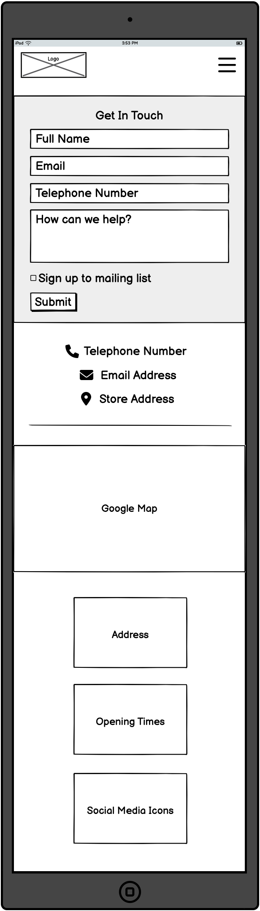

# **Wales Tartan Centres**

[View the live project here](https://danielanthonycollins.github.io/wales-tartan-centres/index.html)

## **Site Overview**

Wales Tartan Centres is a local business who provide Welsh kilt hire throughout South Wales for weddings and other formal events. The main target audience is couples getting married but also anyone looking for something different to wear to a formal occasion.
​

​

## Table of contents:

- [**Wales Tartan Centres**](#wales-tartan-centres)
  - [**Site Overview**](#site-overview)
  - [Table of contents:](#table-of-contents)
  - [**Planning stage**](#planning-stage)
    - [**Target Audiences:**](#target-audiences)
    - [**User Stories:**](#user-stories)
    - [**Site Aims:**](#site-aims)
    - [**Wireframes:**](#wireframes)
    - [**Color Scheme:**](#color-scheme)
  - [**Typography**](#typography)
  - [**Current Features Common to all pages**](#current-features-common-to-all-pages)
  - [**Other Features**](#other-features)
  - [**Future-Enhancements**](#future-enhancements)
  - [**Testing Phase**](#testing-phase)
  - [**Bugs**](#bugs)
  - [**Deployment**](#deployment)
  - [**Tech**](#tech)
  - [**Credits**](#credits)
    - [**Honorable mentions**](#honorable-mentions)
    - [**Content:**](#content)
    - [**Media:**](#media)

## **Planning stage**

### **Target Audiences:**

​

- Users getting married in the South Wales region
- Users interested in formalwear for their upcoming function
- Users interested in something different to wear to their prom or graduation
  ​

### **User Stories:**

​

- As a user, I want to see the subject matter of the page.
- As a user, I want to navigate the page to find what I require quickly and easily.
- As a user, I want to know which tartans are available to hire
- As a user, I want to find out how much it is to hire a kilt
  ​

### **Site Aims:**

​

- To inform the user about Welsh tartan kilt hire
- To inform the user about the home hire service, for those who live outside of Swansea
- To inform the user on opening times if they wish to visit
- To inform the user about what the company offer when they are in store
- To offer the user an oppertunity to get in contact
  ​​

### **Wireframes:**

​
Home Page Desktop View

Home Page Mobile & Tablet View

Kilt Hire Desktop View

Kilt Hire Mobile & Tablet View

About Us Desktop View

About Us Mobile & Tablet View

Contact Us Desktop View

Contact Us Mobile & Tablet View

### **Color Scheme:**

​
As the company logo is red, I chose to use a red #9d080b from the logo as the main colour for creating backgrounds, hover effects and hr elements etc and a white backround for the entire site to help the red jump of the page.

I used #f8f8f8 for the background of the contact form as this worked well with the red and white colour scheme already in place, and helped to break this page up slightly. It also helped it to stand out from the other elements, as the contact form is the most important part of the page.
​

## **Typography**

​
I decided to import the ASAP font from Google Fonts, which can be found at the top of styles.css and I chose this because I felt it worked well with the company image, it's not a font which is widely used and it styled very nicely onto all pages and elements where it was used.
​

​

## **Current Features Common to all pages**

​

### Navigation Bar:

​

- The user is given links to each page on the website, where the page currenly being viewed is made clear with the darker text.
- Each option is clearly labelled & easy to read.
- On smaller screens the page links are reduced to a hamburger menu to optimize the users experience.
- The logo always acts as a link to the home page.
- The white background helps the logo and page links stand out on the screen.
  ​

### Footer:

​

- The user is given key information via the footer on every page; The company address, opening times and links to social media.
- I decided to include the address in the footer because every customer who wishes to hire from the company will need to visit their premises, so the customer needs to know where they need to go.
- I also decided to include the opening times because this was one of the main goals of the website, to inform the user when the company is open for business. Therefore, including this on every page meant the customer was more likely to find it quicker and easier.
- Links to social media were also included as this is such a huge part of company marketing these days. Customers are encouraed to follow the company and keep up to date with their latest updates via social media.
- Each feature within the footer is styled appropriately to match the companies branding.

## **Other Features**

### Home - Hero Image:

​

- I chose to use this image as it's not only powerful but also gives a clear indication what the company is offering. This is the first thing a user sees when they enter the website, so it grabs the users attention instantly and gives them a good idea of what's to come.
- The image is scaled and positioned carefully so even when it becomes more narrow vertically on larger screens you can still see the key components of the outfit.

### Home - Welcome Message:

​

- I included a small welcome message to separate the hero image from the customer reviews section below, and also give the user a small introduction to the company and what they offer.
- It's not too long, as most users don't want to read paragraphs of text, but gives enough info to the user to make them want to carry on reading elsewhere on the website.

### Home - Customer Reviews:

​

- The companies customer reviews were included on the home page so that users could see what previous customers of the company think about their products and quality of service.
- This was styled with a red background and white text to separate the welcome message above and footer below, but also to help this section stand out on the page.
  ​

## **Future-Enhancements**

​

## **Testing Phase**

- Responsiveness - How do you test this, dev tools? checking on multiple devices?
  ​
- Functionality - Each feature needs to be tested before something is complete, talk about the process, click each link check each image, does form validation work, if your using javascript or anything else, does it always behave as the user expects
  ​

### Validators

- HTML validator results (using [Markup Validation Service](https://validator.w3.org/)):

  - index.html

  

  - kilt-hire.html

  

  - about-us.html

  

  - contact.html

  

  - 404.html

  

  - thank-you.html

  

- CSS validator results (using [CSS Validation Service](https://jigsaw.w3.org/css-validator/)):

  - CSS main result:

  

  - CSS warnings:

  Three warnings were as per the image below. The first is due to the import of Google Fonts. The last two were due to a background and border color being the same, however this was needed to apply consistency to the hover feature applied to the button.

  

- Accessibility validator results (using [WAVE](https://wave.webaim.org/)):

  - index.html - No errors found. Full results can be found [here](https://wave.webaim.org/report#/https://danielanthonycollins.github.io/wales-tartan-centres/index.html).

  - kilt-hire.html - No errors found. Full results can be found [here](https://wave.webaim.org/report#/https://danielanthonycollins.github.io/wales-tartan-centres/kilt-hire.html).

  - about-us.html - No errors found. Full results can be found [here](https://wave.webaim.org/report#/https://danielanthonycollins.github.io/wales-tartan-centres/about-us.html).

  - contact.html - No errors found. Full results can be found [here](https://wave.webaim.org/report#/https://danielanthonycollins.github.io/wales-tartan-centres/contact.html).

  - 404.html - No errors found. Full results can be found [here](https://wave.webaim.org/report#/https://danielanthonycollins.github.io/wales-tartan-centres/404.html).

  - thank-you.html - No errors found. Full results can be found [here](https://wave.webaim.org/report#/https://danielanthonycollins.github.io/wales-tartan-centres/thank-you.html).

​
​

## **Bugs**

Removing Method Post from contact form

​

---

## **Deployment**

I deployed the page on GitHub pages via the following procedure: -
​

1. From the project's [repository](https://github.com/danielanthonycollins/wales-tartan-centres), go to the **Settings** tab.
2. From the left-hand menu, select the **Pages** tab.
3. Under the **Source** section, select **Deploy from a branch** and then the **Main** branch from the drop-down menu and click **Save**.
4. A message will be displayed to indicate a successful deployment to GitHub pages and provide the live link.
   ​
   You can find the live site [here](https://danielanthonycollins.github.io/wales-tartan-centres/index.html)

---

​

## **Tech**

​

- HTML5
- CSS3
- [Bootstrap](https://getbootstrap.com/docs/4.5/getting-started/introduction)
- [Google Fonts](https://fonts.google.com/)
- [Google Maps](https://www.google.com/maps)
- [Fontawesome](https://fontawesome.com/)
  ​

## **Credits**

### **Honorable mentions**

​

### **Content:**

​
https://www.w3schools.com/howto/howto_css_style_hr.asp

https://stackoverflow.com/questions/6722467/how-do-i-remove-the-default-link-color-of-the-html-hyperlink-a-tag

https://stackoverflow.com/questions/220273/how-can-i-reorder-my-divs-using-only-css

https://blog.hubspot.com/website/how-to-embed-google-map-in-html

### **Media:**

​
Images go here
