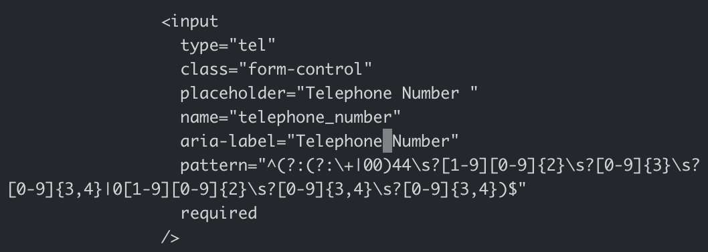

# **Wales Tartan Centres**

[View the live project here](https://danielanthonycollins.github.io/wales-tartan-centres/index.html)

## **Site Overview**

Wales Tartan Centres is a local business who provide Welsh kilt hire throughout South Wales for weddings and other formal events. The main target audience is couples getting married but also anyone looking for something different to wear to a formal occasion.

## Table of contents:

- [**Wales Tartan Centres**](#wales-tartan-centres)
  - [**Site Overview**](#site-overview)
  - [Table of contents:](#table-of-contents)
  - [**Planning stage**](#planning-stage)
    - [**Target Audiences:**](#target-audiences)
    - [**User Stories:**](#user-stories)
    - [**Site Aims:**](#site-aims)
    - [**Wireframes:**](#wireframes)
    - [**Color Scheme:**](#color-scheme)
  - [**Typography**](#typography)
  - [**Current Features Common to all pages**](#current-features-common-to-all-pages)
  - [**Other Features**](#other-features)
  - [**Future Enhancements**](#future-enhancements)
  - [**Testing Phase**](#testing-phase)
  - [**Bugs**](#bugs)
  - [**Deployment**](#deployment)
  - [**Tech**](#tech)
  - [**Credits**](#credits)
    - [**Honorable mentions**](#honorable-mentions)
    - [**Content:**](#content)
    - [**Media:**](#media)

## **Planning stage**

### **Target Audiences:**

- Users getting married in the South Wales region
- Users interested in formalwear for their upcoming function
- Users interested in something different to wear to their prom or graduation

### **User Stories:**

- As a user, I want to see the subject matter of the page.
- As a user, I want to navigate the page to find what I require quickly and easily.
- As a user, I want to know which tartans are available to hire
- As a user, I want to find out how much it is to hire a kilt

### **Site Aims:**

- To inform the user about Welsh tartan kilt hire
- To inform the user about the home hire service, for those who live outside of Swansea
- To inform the user on opening times if they wish to visit
- To inform the user about what the company offer when they are in store
- To offer the user an oppertunity to get in contact

### **Wireframes:**

Home Page Desktop View

Home Page Mobile & Tablet View

Kilt Hire Desktop View

Kilt Hire Mobile & Tablet View

About Us Desktop View

About Us Mobile & Tablet View

Contact Us Desktop View

Contact Us Mobile & Tablet View

### **Color Scheme:**

As the company logo is red, I chose to use a red #9d080b from the logo as the main colour for creating backgrounds, hover effects and hr elements etc and a white backround for the entire site to help the red jump of the page.

I used #f8f8f8 for the background of the contact form as this worked well with the red and white colour scheme already in place, and helped to break this page up slightly. It also helped it to stand out from the other elements, as the contact form is the most important part of the page.

## **Typography**

I decided to import the [ASAP](https://fonts.google.com/specimen/Asap?query=ASAP) font from Google Fonts, which can be found at the top of styles.css and I chose this because I felt it worked well with the company image, it's not a font which is widely used and it styled very nicely onto all pages and elements where it was used.

## **Current Features Common to all pages**

### Navigation Bar:

Desktop view:

Mobile view:

- The user is given links to each page on the website, where the page currenly being viewed is made clear with the darker text.
- Each option is clearly labelled & easy to read.
- On smaller screens the page links are reduced to a hamburger menu to optimize the users experience.
- The logo always acts as a link to the home page.
- The white background helps the logo and page links stand out on the screen.
- This section is linked to the user story 'As a user, I want to navigate the page to find what I require quickly and easily.'

### Footer:

- The user is given key information via the footer on every page; The company address, opening times and links to social media.
- I decided to include the address in the footer because every customer who wishes to hire from the company will need to visit their premises, so the customer needs to know where they need to go.
- I also decided to include the opening times because this was one of the main goals of the website, to inform the user when the company is open for business. Therefore, including this on every page meant the customer was more likely to find it quicker and easier.
- Links to social media were also included as this is such a huge part of company marketing these days. Customers are encouraed to follow the company and keep up to date with their latest updates via social media.
- Each feature within the footer is styled appropriately to match the companies branding.

## **Other Features**

### Home - Hero Image:

- I chose to use this image as it's not only powerful but also gives a clear indication what the company is offering. This is the first thing a user sees when they enter the website, so it grabs the users attention instantly and gives them a good idea of what's to come.
- The image is scaled and positioned carefully so even when it becomes more narrow vertically on larger screens you can still see the key components of the outfit.

### Home - Welcome Message:

- I included a small welcome message to separate the hero image from the customer reviews section below, and also give the user a small introduction to the company and what they offer.
- It's not too long, as most users don't want to read paragraphs of text, but gives enough info to the user to make them want to carry on reading elsewhere on the website.

### Home - Customer Reviews:

- The companies customer reviews were included on the home page so that users could see what previous customers of the company think about their products and quality of service.
- This was styled with a red background and white text to separate the welcome message above and footer below, but also to help this section stand out on the page.

### Kilt Hire - Products:

- Please note that this feature has three products, the screenshot shows an example of one product for illustration purposes.
- This feature allows the user to see which tartan kilt outfits are available to hire and how much they cost. Each product has some information which is specific to that particular tartan to help the customer in making their decision.
- This feature is neatly broken up into three rows, one for each product, with the companies red branding shown in a reverse grid pattern.
- This section relates to the user story 'As a user, I want to know which tartans are available to hire' and also 'As a user, I want to find out how much it is to hire a kilt'.

### About Us - Main Image:

- I decided to use a staff photo at the top of the about us page, to showcase the team of people who the user can expect to see if they visit the store. This helps to create a connection with the customer before they've even visited, which will make their in store experience even better.
- The image was also chosen as the staff are wearing kilts themselves, in a tartan where the colours match with the red theme of the website and the branding.

### About Us - Our Story:

- This section gives some information on the companies history and stresses how much they've grown over the years as a business.
- The red line underneath the heading was used to match with the same line shown in the footer, for continuity.

### About Us - Home Hire Service:

- This section is based on the same red customer reviews section shown on the home page, just with some different information.
- One of the site aims was to promote this service that the company offers, so I decided to use the strong red background with white text, to really make it stand out. I also included a home icon using Fontawesome, to draw the users eye to this feature.

### Contact - Contact Form:

- This feature allows the user to submit their details along with an enquiry to the company, so they can respond in their own time.
- It also features a tick box allowing the user to sign up to their mailing list, and receive emails with offers and special promotions.
- Full Name, Email Address, Telephone number and How can we help you? are required fields, the tick box is optional. The email box features the email input type, and so the website won't let the user submit their enquiry with an incorrectly formatted email address.
- Once submitted, the page re-directs to a thank you page where the user is told the company will reply ASAP (this feature can be seen below).

### Contact - Contact Information:

- This feature displays the companies telephone number, email address and store address should they wish to contact or visit the company themselves.
- Each contact method starts with the relevant font awesome icon, styled to match the branding of the rest of the website.

### Contact - Google Map:

- The Google Map feature allows the user to see where the companies store is actually located on a physical map, which is much easier and more relatable than simply looking at a physical address.
- The map includes controls to allow the user to zoom in and out, and also view on a larger map which directs them to Google.

### Thank You Page:

- This is the message shown on the thank you page when a user submits an enquiry using the contact form. The user is told they will be contacted ASAP about their enquiry, and confirms that their enquiry has been successfully submitted.

### 404 Error Page:

- This is the message shown by the 404 page when the user tries to navigate to a page on the website which doesn't exist or is not working.

## **Future Enhancements**

The following enhancements could be made in the future to improve the website: telephoneattemptscreenshot.png

- I tried including the following code for the telephone input in the contact form, to add some additional validation and avoid users entering incorrect telephone numbers. However, even though it did provide validation, it was too specific and the standard error message the user received didn't provide a sufficient explanation as to why it wouldn't accept the data entered, the user would have been left to figure it out for themselves. This would provide a poor user experience, and could potentially result in the user leaving the website without providing their contact information. So I decided to remove it. In the future, this code could be developed further and reimplemented to give the website the validation initially intended, but with more specific instructions if the user enters data which doesn't meet the validation requirements.

  

- A 'Why use us?' page could be added showing the companies USP's (unique selling points), with images to support each USP. For example, kilts are actually made on-site, so a photo of someone making a kilt backed up by an image from behind the scenes.
- More input types could be added to the contact form, such as function date and customers address to give the company more information about the person enquiring, and also what their needs are.
- A short muted video could be added to promote the company and the products offered, for those who prefer a video to see the options available, rather than static images.

## **Testing Phase**

### **Responsiveness**

Responsiveness was checked and worked as intended with the following browsers and screen sizes:

- Extra Large (27" Mac Desktop):

  - Chrome (114.0.5735.133 Official Build x86_64)
  - Safari (16.5 17615.2.9.11.6, 17615)
  - Firefox (114.0.1 64-bit)

- Large (15" Macbook Pro Laptop):

  - Chrome (114.0.5735.133 Official Build x86_64)
  - Safari (16.5 17615.2.9.11.6, 17615)
  - Firefox
    (114.0.1 64-

- Medium (10.9" iPad):

  - Chrome
  - Safari
  - Firefox

- Small (6" iPhone 13):

  - Chrome (114.0.5735.124)
  - Safari
  - Firefox (114.2 31625)

- Small (Galaxy Fold 3):

  - Chrome
  - Safari
  - Firefox

Devtools was also used to check the responsiveness as various screen sizes and devices from the list of devices available. All were fully responsive and caused no issues.

### **Functionality**

Functionality of the website was tested as follows:

- When the logo in the navigation bar is clicked, this should direct the user to the home page from any page on the website. This was checked on all pages and passed.
- Every page link directs the user to the relevant page, from anywhere in the website. When viewing a page, the active page should be highlighted with darker text in the navigation bar. This is the case for all four of the main pages.
- When the social media links are clicked in the footer, this should open a new tab and direct the user to the relevant social media platform including Facebook, Instagram and Youtube. When hovered over, the icon should turn red and then back to black when moved away. This was checked on all pages and passed.
- On the contact page, the contact form was tested extensively with different scenarios where different required fields were deliberately left blank to ensure the user couldn't submit the form without the required information. The form was also checked to ensure the user wasn't required to enter or select anything that they didn't have to. The email field was tested with 'test', 'test@' and then finally 'test@test.com' with only the third input being accepted when submitted. When submitted, the form should direct to the thank-you.html page, which upon testing it did.
- Also on the contact page, the email link was tested to ensure when it's clicked or tapped, a new email is started on the users device to the correct email address, to avoid manual input error if the user decided to write this down and type the email themselves. When the email was clicked, a new email was started with the email address already filled in.
- A 404.html page was added for instances where the website can't find the page the user is trying to access. Although a default 404 error page would show automatically, I didn't want the customer to be directed off the website and give them the option to go to another page via the navigation bar, instead of a white page with a simple error message. To test if the customer is re-directed to 404.html automatically where a 404 error occurs, I changed the /page section of the URL to various random number and letter sequences and in all cases the default 404.html page was shown.

### **Validators**

- HTML validator results (using [Markup Validation Service](https://validator.w3.org/)):

  - index.html

  

  - kilt-hire.html

  

  - about-us.html

  

  - contact.html

  

  - 404.html

  

  - thank-you.html

  

- CSS validator results (using [CSS Validation Service](https://jigsaw.w3.org/css-validator/)):

  - CSS main result:

  

  - CSS warnings:

  Three warnings were as per the image below. The first is due to the import of Google Fonts. The last two were due to a background and border color being the same, however this was needed to apply consistency to the hover feature applied to the button.

  

- Accessibility validator results (using [WAVE](https://wave.webaim.org/)):

  - index.html - No errors found. Full results can be found [here](https://wave.webaim.org/report#/https://danielanthonycollins.github.io/wales-tartan-centres/index.html).

  - kilt-hire.html - No errors found. Full results can be found [here](https://wave.webaim.org/report#/https://danielanthonycollins.github.io/wales-tartan-centres/kilt-hire.html).

  - about-us.html - No errors found. Full results can be found [here](https://wave.webaim.org/report#/https://danielanthonycollins.github.io/wales-tartan-centres/about-us.html).

  - contact.html - No errors found. Full results can be found [here](https://wave.webaim.org/report#/https://danielanthonycollins.github.io/wales-tartan-centres/contact.html).

  - 404.html - No errors found. Full results can be found [here](https://wave.webaim.org/report#/https://danielanthonycollins.github.io/wales-tartan-centres/404.html).

  - thank-you.html - No errors found. Full results can be found [here](https://wave.webaim.org/report#/https://danielanthonycollins.github.io/wales-tartan-centres/thank-you.html).

## **Bugs**

I found the following bugs during the development process:

- Contact Form

  - Problem: When submitted, the contact form was not re-directing the user to the thank-you.html page.
  - Cause: The method="post" attribute was confusing the browser
  - Resolution: The method attribute was removed completely and the form re-directed the customer correctly.

- Accessibility error when testing with Lighthouse

  - Problem: When testing the about-us.html, index.html and kilt-hire.html pages with lighthouse, the report listed an aria attribute as invalid.
  - Cause: The aria-description attribue used within these pages
  - Resolution: After discussing with my mentor and both of us looking into this in great detail, we decided to leave this as it was. This is because when an aria-label is used instead, lighthouse prefers this however the HTML validator does not, which is the reason why I used description in the first place. The [HTML validator](https://validator.w3.org/) deemed this an acceptable attribute as did the [WAVE accessibility validator](https://wave.webaim.org/).

- Vertical alignment on kilt-hire.html
  - Problem: Even with vertical-align set to 'middle' for each kilt hire products white text description, it was still showing at the top of each red section as opposed to the middle. This left a large red gap at the bottom of the red box which looked odd.
  - Cause: I was advised that vertical-align is a very tricky style declaration to perfect and can cause problems by my mentor.
  - Resolution: Using devtools to try a few different possible solutions, I used the align-self property instead and added the 'red-background-correction' class to fill in the missing red sections above and below the text, otherwise the red background would have just fitted to the text and not matched with the image height.

---

## **Deployment**

I deployed the page on GitHub pages via the following procedure:

1. From the project's [repository](https://github.com/danielanthonycollins/wales-tartan-centres), go to the **Settings** tab.
2. From the left-hand menu, select the **Pages** tab.
3. Under the **Source** section, select **Deploy from a branch** and then the **Main** branch from the drop-down menu and click **Save**.
4. A message will be displayed to indicate a successful deployment to GitHub pages and provide the live link.

You can find the live site [here](https://danielanthonycollins.github.io/wales-tartan-centres/index.html)

---

## **Tech**

- HTML5
- CSS3
- [Bootstrap](https://getbootstrap.com/docs/4.5/getting-started/introduction)
- [Google Fonts](https://fonts.google.com/)
- [Google Maps](https://www.google.com/maps)
- [Fontawesome](https://fontawesome.com/)

## **Credits**

Thank you to my employer, Wales Tartan Centres for allowing me to use their own stock images, logo and branding for this project.

### **Honorable mentions**

Special thanks to my mentor Richard Wells for his excellent advice and support throughout this project.

### **Content:**

- w3schools helped me to remember how to correctly style the hr element using the shorthand border-top property - https://www.w3schools.com/howto/howto_css_style_hr.asp

- Stackoverflow helped me to remove the default blue styling that appears for a link. In this particular case, I applied the following declarations to the email address on the contact page 'text-decoration: none' and 'color: inherit;' - https://stackoverflow.com/questions/6722467/how-do-i-remove-the-default-link-color-of-the-html-hyperlink-a-tag

- Stackoverflow also helped me to control the display order of my divs on the kilt-hire.html page when viewed on a mobile. Without the 'display: flex;' declaration and suggestion to order the divs by id for smaller screens, the running order on the page would be incorrect and the user wouldn't know which text description was for which image - https://stackoverflow.com/questions/220273/how-can-i-reorder-my-divs-using-only-css

- The following page helped me remember how to embed a Google Map onto my contact page - https://blog.hubspot.com/website/how-to-embed-google-map-in-html

### **Media:**

All stock images were kindly provided by Wales Tartan Centres, for use with this project.
